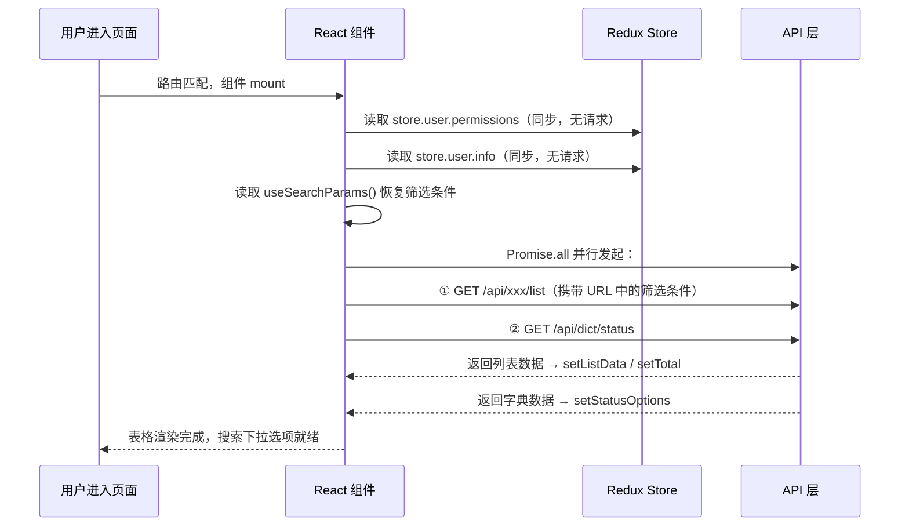
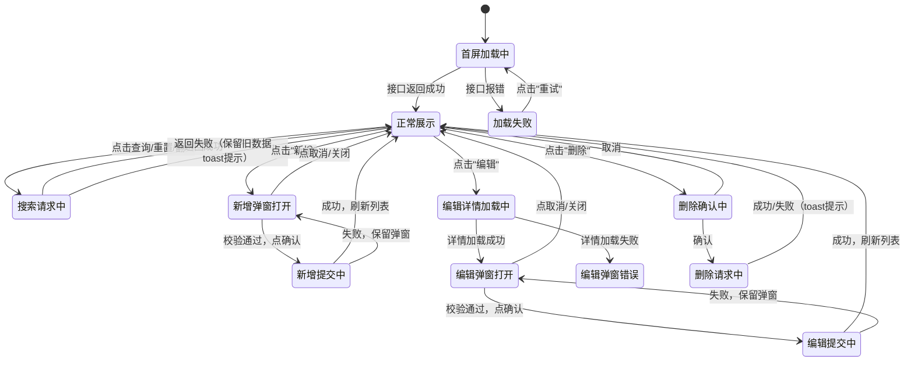

# PRD 页面文档模板（tpl-prd）

> ⚠️ 生成原则：本模板的目标是"照着文档能从零还原这个页面，功能完全一致"。
> 每一节都必须如实填写，不允许使用"xxx"或"待补充"占位。
> 分析代码时，所有细节（判断条件、字段名、接口路径、提示文案）都要提取出来写进文档。

```markdown
# [页面中文名称] 页面文档

> **路由路径：** `/xxx`
> **组件文件：** `src/pages/XxxPage.jsx`
> **需要登录：** 是 / 否
> **所需权限：** `permission:xxx:view`（无权限跳转 /403）
> **生成时间：** 2026-03-05 09:16:18

---

## 一、页面概述

**页面定位：** 一句话说清楚这个页面在系统中负责什么业务。

**入口来源：** 用户通过哪些路径进入本页面（侧边栏菜单 / 从哪个页面跳转 / 浏览器直接访问）。

**离开去向：** 本页面会跳转到哪些页面（点击什么 → 去哪里）。

| 触发操作 | 跳转目标 | 携带参数 |
|---------|---------|---------|
| 点击列表行名称 | `/detail/:id` | id |
| 点击"返回"按钮 | `/list` | 无 |

---

## 二、页面布局结构

> 描述页面的视觉分区，让开发者不看设计稿也能还原布局。

```
┌─────────────────────────────────────────────────┐
│  页面标题：xxx管理          [新增按钮] [导出按钮]  │
├─────────────────────────────────────────────────┤
│  搜索区                                          │
│  [关键词输入框]  [状态下拉]  [时间范围]  [查询] [重置] │
├─────────────────────────────────────────────────┤
│  已选 N 条  [批量删除]                            │
├─────────────────────────────────────────────────┤
│  数据表格                                        │
│  ☐ | 序号 | 名称 | 状态 | 创建时间 | 操作        │
│  ────────────────────────────────────────────── │
│  ☐ |  1  | ... | ... |   ...   | 编辑 删除      │
│  ...                                             │
├─────────────────────────────────────────────────┤
│  分页：共 N 条  每页 20 条  [< 1 2 3 >]          │
└─────────────────────────────────────────────────┘
```

**弹窗/抽屉布局（如有）：**
```
┌──────────────────────────────┐
│ 新增xxx               [×关闭] │
├──────────────────────────────┤
│ 名称：[____________] *必填    │
│ 状态：[下拉选择____]  *必填   │
│ 备注：[__________________]   │
├──────────────────────────────┤
│              [取消]  [确认]   │
└──────────────────────────────┘
```

---

## 三、页面数据来源总览

> 全页面数据"一张地图"，读这一节就能知道所有数据从哪来。

| 数据名称 | 来源类型 | 接口 / 位置 | 加载时机 | 用途 |
|---------|---------|-----------|---------|------|
| 列表数据 | 后端接口 | `GET /api/xxx/list` | 首屏、条件变化、操作后刷新 | 主表格渲染 |
| 状态字典 | 后端接口 | `GET /api/dict/status` | 首屏，只一次 | 状态下拉选项、状态展示文案 |
| 用户权限 | Redux Store | `store.user.permissions` | 直接读取 | 控制按钮显示/隐藏 |
| 当前用户信息 | Redux Store | `store.user.info` | 直接读取 | 新增时自动填充"创建人" |
| 路由参数 | URL Params | `useParams().id` | 直接读取 | 详情/编辑页定位资源 |
| 搜索条件 | URL Query | `useSearchParams()` | 直接读取 | 支持从外部带参进入，恢复筛选 |

**数据加载关系：**
```
并行（互不依赖）：
  ├── GET /api/xxx/list
  └── GET /api/dict/status

直接读取（无需等待）：
  ├── store.user.permissions
  ├── store.user.info
  └── useSearchParams()
```

---

## 四、功能清单总览

| 编号 | 功能名称 | 功能类型 | 所需权限 | 说明 |
|------|---------|---------|---------|------|
| F01 | 列表展示 | 展示 | view | 分页展示数据，默认按创建时间倒序 |
| F02 | 搜索过滤 | 交互 | view | 关键词 / 状态 / 时间范围组合筛选 |
| F03 | 新增 | 操作 | create | 弹窗表单，填写后提交 |
| F04 | 编辑 | 操作 | edit | 弹窗回填，修改后提交 |
| F05 | 删除（单条） | 操作 | delete | 二次确认后删除 |
| F06 | 批量删除 | 操作 | delete | 勾选多条后批量删除 |
| F07 | 导出 | 操作 | export | 按当前筛选条件导出 Excel |
| F08 | 查看详情 | 跳转 | view | 点击名称跳转详情页 |

---

## 五、功能详细说明

### F01 - 列表展示

**功能描述：** 以分页表格形式展示数据，默认每页 20 条，按 `createdAt` 倒序排列。

**触发条件：** 页面 mount、搜索条件变化、分页变化、增删改操作成功后。

**交互细节：**
- 请求发起时，表格区域显示 loading 骨架屏，期间操作按钮不可点击
- 请求成功后，更新表格数据和总条数
- 请求失败时，表格区域显示错误提示："数据加载失败，请刷新重试"，提供"重试"按钮
- 数据为空时，表格显示空状态图：图标 + 文案"暂无数据"

**接口：**
- 请求：`GET /api/xxx/list`
- 入参：
  ```json
  {
    "page": 1,
    "pageSize": 20,
    "keyword": "",
    "status": null,
    "startTime": null,
    "endTime": null
  }
  ```
- 出参：
  ```json
  {
    "code": 200,
    "data": {
      "list": [
        {
          "id": "string",
          "name": "string",
          "status": 1,
          "remark": "string",
          "createdBy": "string",
          "createdAt": "2026-03-05 09:16:18",
          "updatedAt": "2026-03-05 09:16:18"
        }
      ],
      "total": 100,
      "page": 1,
      "pageSize": 20
    },
    "message": "success"
  }
  ```

**涉及状态（State）：**
```js
const [listData, setListData] = useState([])      // 列表数据
const [total, setTotal] = useState(0)              // 总条数
const [page, setPage] = useState(1)                // 当前页
const [pageSize, setPageSize] = useState(20)       // 每页条数
const [loading, setLoading] = useState(false)      // 加载状态
const [loadError, setLoadError] = useState(false)  // 加载失败状态
```

---

### F02 - 搜索过滤

**功能描述：** 顶部搜索栏提供多条件组合筛选，点击"查询"触发，支持"重置"恢复默认值。

**搜索字段说明：**

| 字段 | 组件类型 | 占位文本 | 默认值 | 说明 |
|------|---------|---------|-------|------|
| keyword | Input | 请输入名称关键词 | 空 | 模糊匹配 name 字段 |
| status | Select | 请选择状态 | 全部（null） | 单选，选项来自状态字典 |
| 时间范围 | RangePicker | 请选择创建时间 | 空 | 对应 startTime / endTime |

**交互细节：**
- 点击"查询"：重置 `page=1`，携带当前所有筛选条件发起请求
- 点击"重置"：清空所有字段，恢复默认值，`page=1`，发起请求
- 按 `Enter` 键：等同于点击"查询"
- 搜索条件同步写入 URL Query，刷新页面后筛选条件保留

**业务规则：**
- `keyword` 最多 50 字，超出截断不报错
- 时间范围：`endTime` 不能早于 `startTime`，违反时提示"结束时间不能早于开始时间"
- 三个筛选条件均为可选，全空时查询全量数据

**涉及状态（State）：**
```js
const [keyword, setKeyword] = useState('')
const [status, setStatus] = useState(null)
const [timeRange, setTimeRange] = useState([null, null])  // [startTime, endTime]
```

---

### F03 - 新增

**功能描述：** 点击页面右上角"新增"按钮，弹出 Modal 弹窗，填写表单后提交创建新记录。

**触发条件：** 用户拥有 `permission:xxx:create` 权限（无权限时按钮不渲染）。

**交互流程：**
```
点击"新增"
  → 打开 Modal（标题"新增xxx"）
  → 表单初始化为空
  → 用户填写
  → 点击"确认"
     → 前端校验（validateFields）
       → 校验失败：字段下方显示错误提示，弹窗保持打开
       → 校验通过：按钮变为 loading 状态，发起请求
          → 请求成功：关闭弹窗、重置表单、刷新列表（回第1页）、顶部提示"新增成功"
          → 请求失败：按钮恢复，弹窗保持打开，顶部提示接口返回的 message
  → 点击"取消"或右上角[×]：关闭弹窗，表单数据丢弃
```

**表单字段：**

| 字段名 | 显示名 | 组件 | 必填 | 校验规则 | 错误提示 |
|--------|-------|------|------|---------|---------|
| name | 名称 | Input | ✅ | 1-50字，不可与已有记录重名 | "请输入名称" / "名称不能超过50字" / "名称已存在" |
| status | 状态 | Select | ✅ | 枚举值 1或2 | "请选择状态" |
| remark | 备注 | Textarea | ❌ | 最多200字 | "备注不能超过200字" |

**接口：**
- 请求：`POST /api/xxx`
- 入参：
  ```json
  { "name": "string", "status": 1, "remark": "string" }
  ```
- 出参：
  ```json
  { "code": 200, "data": { "id": "string" }, "message": "新增成功" }
  ```
- 错误码：
  - `400`：参数校验失败，message 直接展示
  - `409`：名称已存在，提示"名称已存在，请修改后重试"

**涉及状态（State）：**
```js
const [addModalOpen, setAddModalOpen] = useState(false)
const [addSubmitting, setAddSubmitting] = useState(false)
const [addForm] = Form.useForm()
```

---

### F04 - 编辑

**功能描述：** 点击列表行的"编辑"按钮，弹出 Modal 弹窗，回填当前行数据，修改后提交。

**触发条件：** 用户拥有 `permission:xxx:edit` 权限（无权限时"编辑"按钮不渲染）。

**交互流程：**
```
点击"编辑"
  → 打开 Modal（标题"编辑xxx"）
  → 发起 GET /api/xxx/:id 获取最新数据
     → 请求中：弹窗内显示 loading
     → 请求成功：form.setFieldsValue(data) 回填表单
     → 请求失败：弹窗显示"数据加载失败"，仅保留关闭按钮
  → 用户修改字段
  → 点击"确认" → 流程同新增，接口改为 PUT /api/xxx/:id
  → 点击"取消"：关闭弹窗，修改丢弃
```

**接口：**
- 获取详情：`GET /api/xxx/:id`
  - 出参：单条记录完整对象（同列表字段）
- 提交修改：`PUT /api/xxx/:id`
  - 入参：`{ "name": "string", "status": 1, "remark": "string" }`
  - 出参：`{ "code": 200, "message": "修改成功" }`

**涉及状态（State）：**
```js
const [editModalOpen, setEditModalOpen] = useState(false)
const [editingRecord, setEditingRecord] = useState(null)   // 当前编辑的记录
const [editLoading, setEditLoading] = useState(false)      // 详情加载中
const [editSubmitting, setEditSubmitting] = useState(false)
const [editForm] = Form.useForm()
```

---

### F05 - 删除（单条）

**功能描述：** 点击列表行"删除"按钮，二次确认后删除该条记录。

**触发条件：** 用户拥有 `permission:xxx:delete` 权限（无权限时"删除"按钮不渲染）。

**交互流程：**
```
点击"删除"
  → 弹出 Popconfirm 气泡确认框
     标题："确认删除该记录吗？删除后不可恢复。"
     按钮："取消" / "确认删除"（红色）
  → 点击"取消"：气泡关闭，无任何操作
  → 点击"确认删除"
     → 发起 DELETE /api/xxx/:id
        → 成功：提示"删除成功"，刷新列表
               若删除后当前页无数据，自动跳回上一页（page - 1）
        → 失败：提示接口返回的 message
```

**接口：**
- `DELETE /api/xxx/:id`
- 出参：`{ "code": 200, "message": "删除成功" }`
- 错误码：`403` 无权限，`404` 记录不存在（提示"记录不存在或已被删除"）

---

### F06 - 批量删除

**功能描述：** 勾选多条记录后，点击"批量删除"按钮，二次确认后批量删除。

**触发条件：** 用户拥有 `permission:xxx:delete` 权限，且至少勾选了 1 条记录。

**交互细节：**
- 未勾选时，"批量删除"按钮置灰不可点击
- 勾选后，顶部显示"已选 N 条"和"批量删除"按钮
- 确认弹窗文案："确认删除已选的 N 条记录吗？删除后不可恢复。"
- 全选框：勾选当前页所有行；跨页不保留勾选状态

**接口：**
- `DELETE /api/xxx/batch`
- 入参：`{ "ids": ["id1", "id2", "id3"] }`
- 出参：`{ "code": 200, "message": "已删除 N 条" }`

**涉及状态（State）：**
```js
const [selectedRowKeys, setSelectedRowKeys] = useState([])
```

---

### F07 - 导出

**功能描述：** 按当前筛选条件导出全量数据为 Excel 文件，文件名含导出时间。

**触发条件：** 用户拥有 `permission:xxx:export` 权限（无权限时按钮不渲染）。

**交互细节：**
- 点击"导出"按钮 → 按钮变为 loading，文字改为"导出中..."
- 请求以当前全部筛选条件（不受分页限制）查询所有数据
- 后端返回文件流，前端通过 `<a download>` 触发浏览器下载
- 导出成功：按钮恢复，提示"导出成功"
- 导出失败：按钮恢复，提示"导出失败，请重试"
- 文件命名规则：`xxx数据_2026-03-05 09:16:18.xlsx`

**接口：**
- `GET /api/xxx/export`（返回文件流，`responseType: 'blob'`）
- 入参：同搜索条件（无 page/pageSize）
  ```json
  { "keyword": "", "status": null, "startTime": null, "endTime": null }
  ```

---

### F08 - 查看详情

**功能描述：** 点击列表行的名称文字，跳转到对应详情页。

**交互细节：**
- 名称列文字样式：蓝色、下划线、pointer 光标
- 点击后：`navigate('/detail/' + record.id)`
- 详情页通过 `useParams().id` 获取记录 id

---

## 六、首屏数据加载时序



---

## 七、数据块详细档案

### 数据块①：列表数据 `listData`

| 属性 | 内容 |
|------|------|
| 数据来源 | 后端接口 |
| 请求接口 | `GET /api/xxx/list` |
| 触发时机 | 首屏加载 / 筛选条件变化 / 分页变化 / 增删改成功后 |
| 存储位置 | 本地 `useState` |
| 更新方式 | 全量覆盖 |
| 阻塞首屏 | 是（返回前显示 loading） |

**完整字段结构：**
```json
{
  "id": "string",           // 记录唯一ID
  "name": "string",         // 名称
  "status": 1,              // 1=正常 2=禁用
  "remark": "string",       // 备注，可为空
  "createdBy": "string",    // 创建人姓名
  "createdAt": "2026-03-05 09:16:18",
  "updatedAt": "2026-03-05 09:16:18"
}
```

---

### 数据块②：状态字典 `statusOptions`

| 属性 | 内容 |
|------|------|
| 数据来源 | 后端接口 / 前端常量（注明实际情况） |
| 请求接口 | `GET /api/dict/status` |
| 触发时机 | 首屏加载，只请求一次 |
| 存储位置 | 本地 `useState` |
| 更新方式 | 固定，不刷新 |
| 阻塞首屏 | 否（并行加载，搜索框先占位） |

**字段结构：**
```json
[
  { "label": "正常", "value": 1, "color": "green" },
  { "label": "禁用", "value": 2, "color": "red" }
]
```

**使用位置：**
- 搜索栏"状态"下拉选项
- 表格"状态"列：用 `color` 字段渲染 Tag 颜色
- 编辑/新增弹窗"状态"下拉选项

---

### 数据块③：用户权限 `permissions`

| 属性 | 内容 |
|------|------|
| 数据来源 | Redux Store |
| 位置 | `store.user.permissions`（Array\<string\>） |
| 触发时机 | 组件渲染时直接读取 |
| 阻塞首屏 | 否 |

**权限码与对应 UI 控制：**

| 权限码 | 控制的 UI 元素 |
|--------|--------------|
| `permission:xxx:create` | "新增"按钮（不渲染） |
| `permission:xxx:edit` | 每行"编辑"按钮（不渲染） |
| `permission:xxx:delete` | 每行"删除"按钮 + "批量删除"按钮（不渲染） |
| `permission:xxx:export` | "导出"按钮（不渲染） |

---

### 数据块④：[其他数据块继续补充...]

> **分析提示 - 代码中数据的藏身位置：**
> - `useEffect(()=>{...},[])` → 首屏请求
> - `useEffect(()=>{...},[xxx])` → 依赖变化时请求
> - `useSelector(state => state.xxx)` / `useContext` → Store/Context 数据
> - `useMemo(() => ..., [])` → 派生/计算数据
> - `useParams()` → 路由参数
> - `useSearchParams()` → URL query 参数
> - `props.xxx` → 父组件传入数据
> - `localStorage.getItem('xxx')` → 本地缓存

---

## 八、业务规则与边界条件

> 梳理所有 if/else、三元表达式、条件渲染背后的业务逻辑。

### 权限控制
- 无 `view` 权限：整页跳转 `/403`
- 无 `create` 权限："新增"按钮不渲染（不是置灰，是不渲染）
- 无 `edit` 权限：操作列不显示"编辑"按钮
- 无 `delete` 权限：操作列不显示"删除"按钮，顶部不显示"批量删除"

### 数据校验规则

| 场景 | 字段 | 规则 | 前端提示文案 | 后端错误码 |
|------|------|------|------------|---------|
| 新增/编辑 | name | 必填 | "请输入名称" | 400 |
| 新增/编辑 | name | ≤50字 | "名称不能超过50字" | 400 |
| 新增/编辑 | name | 不可重名 | "名称已存在" | 409 |
| 新增/编辑 | status | 必填 | "请选择状态" | 400 |
| 新增/编辑 | remark | ≤200字 | "备注不能超过200字" | 400 |
| 搜索 | 时间范围 | endTime ≥ startTime | "结束时间不能早于开始时间" | — |

### 特殊边界
- 删除后若当前页已无数据：`page > 1` 时自动 `setPage(page - 1)` 再刷新
- 批量删除时选中条数为 0：按钮置灰，点击无反应
- 导出数据量超过 10000 条：后端返回 `413`，前端提示"数据量过大，请缩小筛选范围后重试"
- 接口超时（>10s）：提示"请求超时，请检查网络后重试"
- 网络断开：提示"网络连接异常，请检查网络"

---

## 九、接口汇总

| 用途 | 方法 | 路径 | 触发时机 |
|------|------|------|---------|
| 获取列表 | GET | `/api/xxx/list` | 首屏 / 条件变更 / 操作后刷新 |
| 获取状态字典 | GET | `/api/dict/status` | 首屏，仅一次 |
| 获取单条详情 | GET | `/api/xxx/:id` | 点击"编辑"时 |
| 新增记录 | POST | `/api/xxx` | 新增弹窗提交 |
| 修改记录 | PUT | `/api/xxx/:id` | 编辑弹窗提交 |
| 删除单条 | DELETE | `/api/xxx/:id` | 单条删除确认 |
| 批量删除 | DELETE | `/api/xxx/batch` | 批量删除确认 |
| 导出 Excel | GET | `/api/xxx/export` | 点击"导出" |

---

## 十、页面状态流转



---

## 十一、关键 UI 元素规格

### 11.1 表格列定义

| 列名 | 字段 | 宽度 | 对齐 | 渲染方式 | 排序 |
|------|------|------|------|---------|------|
| 选择框 | — | 48px | 居中 | Checkbox | — |
| 序号 | — | 60px | 居中 | 行索引+1（非ID） | — |
| 名称 | name | 200px | 左对齐 | 蓝色可点击链接 | — |
| 状态 | status | 100px | 居中 | Tag：1=绿"正常" 2=红"禁用" | — |
| 备注 | remark | — | 左对齐 | 超过1行省略，hover tooltip显示全文 | — |
| 创建人 | createdBy | 120px | 居中 | 纯文字 | — |
| 创建时间 | createdAt | 180px | 居中 | 格式：2026-03-05 09:16:18 | 默认倒序 |
| 操作 | — | 120px | 居中 | "编辑"（蓝）+ "删除"（红），无权限不渲染 | — |

### 11.2 搜索栏字段规格

| 字段 | 组件 | 宽度 | 占位文本 | 默认值 |
|------|------|------|---------|-------|
| 关键词 | Input | 200px | 请输入名称 | 空 |
| 状态 | Select | 150px | 全部状态 | null（全部） |
| 时间范围 | RangePicker | 300px | 开始时间 ~ 结束时间 | 空 |
| 查询按钮 | Button type=primary | — | — | — |
| 重置按钮 | Button | — | — | — |

### 11.3 新增/编辑弹窗规格

| 属性 | 新增 | 编辑 |
|------|------|------|
| 标题 | 新增xxx | 编辑xxx |
| 宽度 | 520px | 520px |
| 关闭方式 | 点×、点取消、ESC | 点×、点取消、ESC |
| 关闭时 | 重置表单 | 重置表单 |
| 确认按钮 | 提交中变 loading | 提交中变 loading |

### 11.4 Toast 提示规格

| 场景 | 类型 | 文案 | 持续时间 |
|------|------|------|---------|
| 新增成功 | success | "新增成功" | 2s |
| 编辑成功 | success | "修改成功" | 2s |
| 删除成功 | success | "删除成功" | 2s |
| 批量删除成功 | success | "已删除 N 条" | 2s |
| 导出成功 | success | "导出成功" | 2s |
| 任意操作失败 | error | 接口返回 message | 3s |
| 网络异常 | error | "网络连接异常，请检查网络" | 3s |
| 请求超时 | error | "请求超时，请重试" | 3s |
```